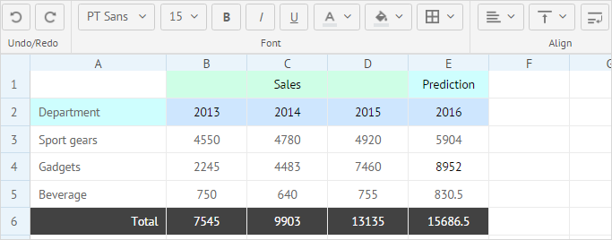

# Introduction

Webix SpreadSheet is a powerful tool for creating tables with various content. You can perform different operations on data within sheets, adjust the appearance of data and table cells, and get the results in the Excel format. The widget also supports import of data from an Excel document.

The guide will provide you with recommendations and hints for convenient and pleasant interaction with Webix SpreadSheet. The book is [available on Github](https://github.com/webix-hub/gitbook-spreadsheet-guide). You can follow the repository to stay tuned for the latest updates.

