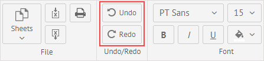

## Entering Data

- To enter data into SpreadSheet, click an empty cell. 

A cell reference is defined as an intersection of a column and a row. For example, a cell A1 is located on the intersection of the 1st row and the A column.

- Enter a text or a number into a cell.

## Navigation in a Sheet

Useful keyboard shortcuts for navigation in Spreadsheet:

- **Enter** - opens editor in a cell.
- **Esc** - closes editor in a cell.
- **Arrow keys** - allow navigating across cells.
- **Tab** - moves focus to the next cell in a sheet. 
- **Shift+Tab** combination - moves focus to the previous cell in a sheet.
- **Shift+Arrow key** combination - extends cells selection by on cell.
- **Ctrl+Shift+Arrow key** combination - extends cells selection to the last nonempty cell in the same column/row. If the closest cell is empty, selection is extended to the next nonempty cell.  
- **Ctrl+C** - copies the content of a cell.
- **Ctrl+V** - pastes the content of a cell. 
- **Ctrl+Z** - cuts the content of a cell.
- **Ctrl+A** - selects all cells in a sheet.
- **Delete** - removes the content of a cell, or the character to the right of the insertion point (in the editing mode)
- **Backspace** - removes the content of a cell, or the character to the left of the insertion point (in the editing mode)

## Cancelling/Repeating Actions

- To undo recent changes, click the Undo button.
- To reapply changes once again, click the Redo button.

