# Working with Cells

## Sorting Data in a Range

You can sort data in a selected range of cells in both ascending and descending directions. There are two ways to do that:

1\) Select a range of cells that contain data to be sorted.

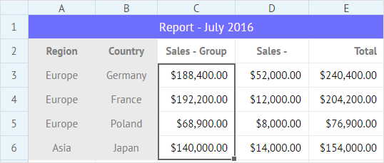

2\) Make use of the corresponding button in the **Edit** section to sort data in either ascending or descending order:

* Click the **Sort A to Z** button to sort data in the descending order:

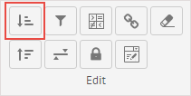

* Click the **Sort Z to A** button to sort data in the ascending order:

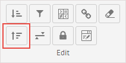

Or:

1\) Right-click the cell/cells with data to be sorted to call the context menu.

2\) Select _Sort_-&gt;_Sort A to Z_, or _Sort_-&gt;_Sort Z to A_ option, depending on the desired sorting direction.

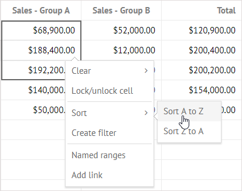

In the image below the range is sorted in the ascending order. Pay attention that the values in the **Total** column are recalculated accordingly:

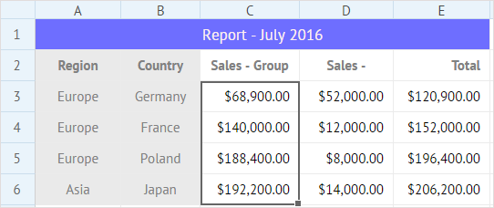

## Adding Filters and Dropdown Lists into Cells

### Adding a Filter

You can add filters for cells of a column. While selecting an option in the added filter, the whole grid data will be filtered according to the value of this option.

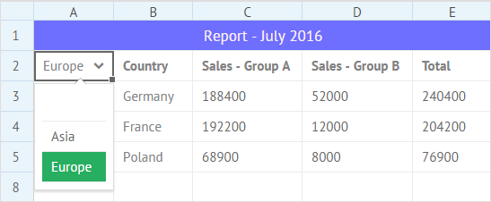

To filter data:

1\) Select the necessary range of cells in a column.

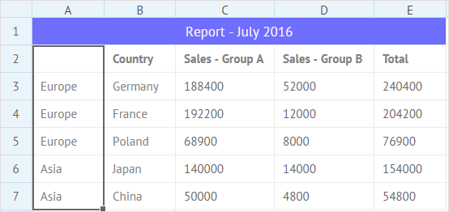

2\) Choose one of the following options:

* Click the **Create filter** button in the **Edit** section to add a filter into the top cell of the selected range.

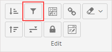

* Right-click the selected range and select the _Create filter_ option in the context menu. 

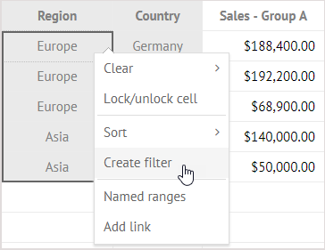

A filter with options \(cells' values from the range\) will appear in the top cell of the selected range.

3\) Click on any filter option to filter data in the grid.

The image below shows a table filtered by the _Europe_ option from the filter.

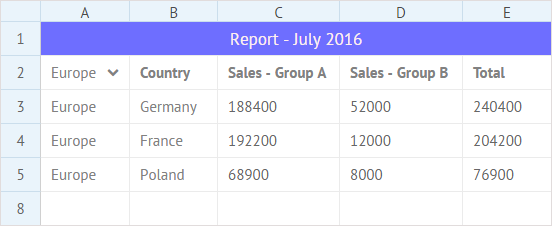

### Adding a Dropdown List

You can add a dropdown list with arbitrary options into a cell of a sheet.

It's really easy to do:

1\) Select a cell to add a dropdown menu into.

2\) Click the **Add dropdown** button in the **Edit** section.

3\) In the appeared popup add the range of cells the values of which will be used as options of the dropdown menu. There are two ways for that:

* Type the reference to the range as a pair of the starting and ending cells as A2:A5
* Select a range of cells in a sheet and the reference will appear in the input automatically

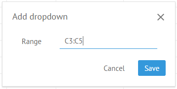

4\) Click the **Save** button to add a dropdown list into a cell.

### Removing Filters and Dropdown Lists

To remove a filter/filters:

1\) Select cells with filters/dropdown lists.

2\) Click the **Clear** button in the **Edit** section of the toolbar.

3\) Select the _Clear dropdowns and filters_ option in the dropdown list.

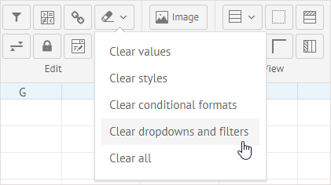

Or:

1\) Select cells with filters/dropdown lists.

2\) Right-click the selected cell/cells to call the context menu.

3\) Select _Clear_-&gt;_Dropdowns and filters_.

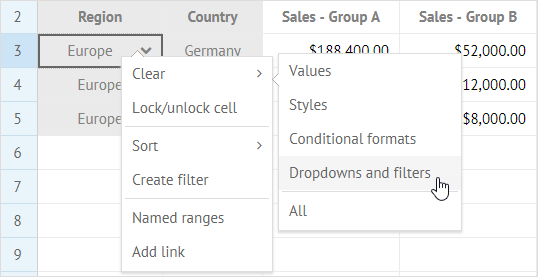

## Locking a Cell

You can lock a cell to forbid editing its content. Locked cells will be marked with small orange locks in the bottom right corner. You can neither set the mouse cursor inside of them, nor change their values.

To lock/unlock cells, you can use one of the two available ways:

* Select a cell or several cells you want to lock and click the **Lock/unlock cell** button in the **Edit** section.

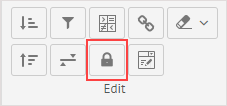

* Right-click a selected cell or a range of cells and choose the **Lock/unlock cell** option in the context menu.

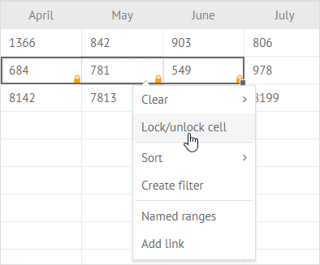

## Adding Link into a Cell

It is possible to add a link to an external resource into a cell.

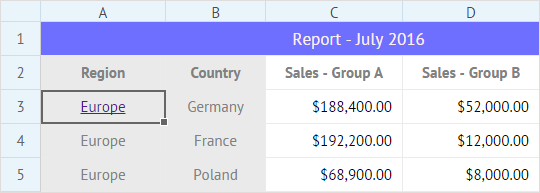

To insert a link into a cell:

1\) Select a cell to add a link into.

2\) Choose one of the following options:

* Click the **Add link** button in the **Edit** section:         

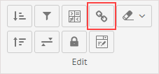

* Right-click a cell and select the **Add link** option in the context menu.

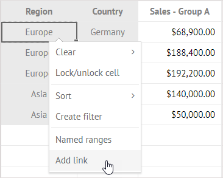

3\) In the appeared popup enter the text of the link in the first line and insert the link into the second line:

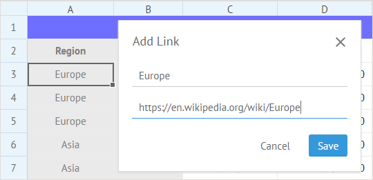

4\) Click the **Save** button to apply changes.

## Adding Image in a Cell

You can add an image into a cell to illustrate data in the spreadsheet.

To insert an image into a cell:

1\) Select a cell to add an image into.

2\) Click the **Image** button in the **Insert** section:

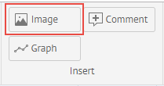

3\) In the appeared popup insert a link to the image or select a file from the computer:

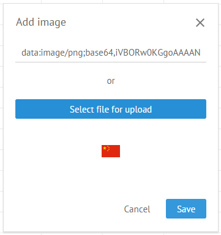

4\) Click the **Save** button to apply changes.

## Adding Sparkline in a Cell

You can add a graph \(sparkline\) into a cell to display tendencies of data values changing in a range of cells.

To insert a graph into a cell:

1\) Select a cell to add a graph into.

2\) Click the **Graph** button in the **Insert** section:

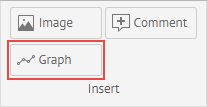

3\) In the appeared popup enter sparkline configuration:

* choose the type of the line
* set the cell range 
* select the color of the graph \(except for the Pie type\) or two colors \(for positive and negative values\) for the Bar type

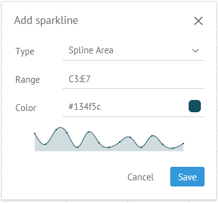

4\) Click the **Save** button to apply changes.

## Adding Comments in a Cell

You can add comments for a cell. To insert comments into a cell:

1\) Select a cell to add comments into.

2\) Choose one of the following options:

* Click the **Comment** button in the **Insert** section:

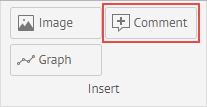

* Right-click a cell and select the **Comment** option in the context menu.

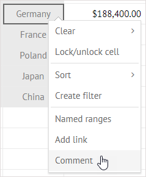

3\) In the appeared popup enter a text of the comment:

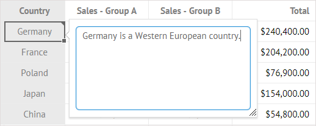

4\) Click any cell outside the textarea to save the comment.

You can change the size of the comment popup by dragging the resizer handle in the right bottom corner.

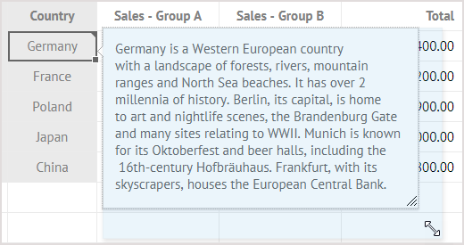

