## Sorting Data

You can sort data in a selected range of cells in both ascending and descending directions. There are two ways to do that:

1) Select a range of cells that contain data to be sorted.

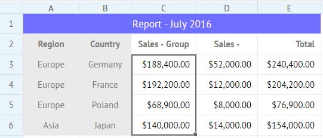

2) Make use of the corresponding button to sort data in either ascending or descending order:

- Click the **Sort A to Z** button to sort data in the descending order:

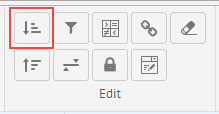

- Click the **Sort Z to A** button to sort data in the ascending order:

Or:

1) Right-click the cell/cells with data to be sorted to call the context menu.

2) Select *Sort*->*Sort A to Z*, or *Sort*->*Sort Z to A* option, depending on the desired sorting direction.

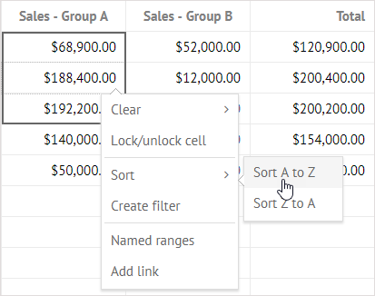

In the image below the range is sorted in the ascending order. Pay attention that the values in the **Total** column are recalculated accordingly:

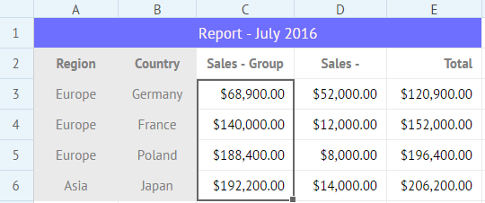

## Filtering 

You can add a filter for cells of a column. While selecting an option in the added filter, the whole grid data will be filtered according to the value of this option.

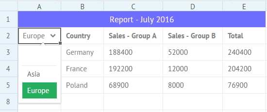

To filter data:

1) Select the necessary range of cells in a column.

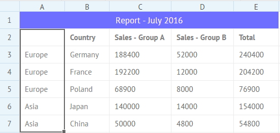

2) Click the **Create filter** button to add a filter into the top cell of the selected range.

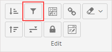

Or right-click the selected range and select the *Create filter* option in the context menu. A filter with options (cells' values from the range) will appear in the top cell of the selected range.

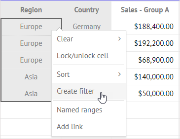

3) Click on any filter option to filter data in the grid.

The image below shows a table filtered by the *Europe* option from the filter.

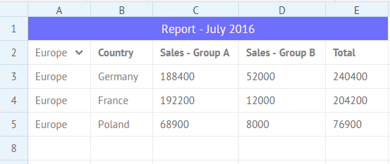

### Removing a filter

To remove a filter/filters:

1) Select a cell/cells with filter/filters.

2) Click the **Clear** button in the **Edit** section of the toolbar.

3) Select the *Clear dropdowns and filters* option in the dropdown list.

Or:

1) Right-click the cell/cells with filter/filters to call the context menu.

2) Select *Clear*->*Dropdowns and filters*.

## Locking a Cell

You can lock a cell to forbid editing its content. Locked cells will be marked with small orange locks in the bottom right corner. You can neither set the mouse cursor inside of them, nor change their values.

To lock/unlock cells, you can use one of the two available ways: 

- Select a cell or several cells you want to lock and click the **Lock/unlock cell** button.

- Right-click a selected cell or a range of cells and choose the **Lock/unlock cell** option in the context menu.

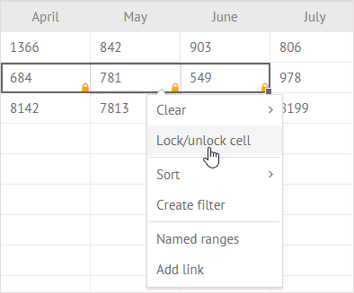

## Adding Link into a Cell

It is possible to add a link to an external resource as a cell value. 

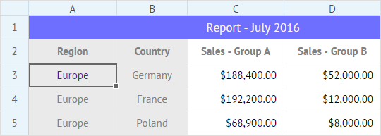

There are two options for that:

1) Select a cell to add a link into.

2) Click the **Add link** button:         
                 
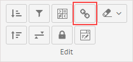          

Or right-click the cell and select the **Add link** option in the context menu.

3) In the appeared popup enter the text of the link in the first line and insert the link into the second line:  

4) Click the **Save** button to apply changes.

## Adding a Dropdown Menu (Editor) into a Cell

You can add a dropdown menu with arbitrary options into a cell of a sheet.

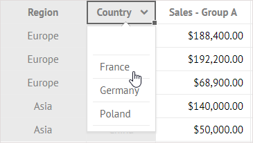

It's really easy to do:

1) Select a cell to add a dropdown menu into.

2) Click the **Add dropdown** button in the **Edit** section.

     

3) In the appeared popup add the range of cells the values of which will be used as options of the dropdown menu.

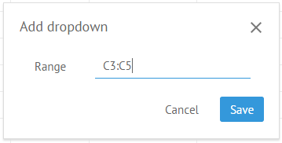     

4) Click the **Save** button to add a dropdown into a cell.
