# Working with Cells

## **Copying, Cutting and Pasting Cells**

### **Copying Cells**

To **copy** a cell, you should take the following steps:

1\) Select a cell or a range of cells you want to copy.

2\) Right-click on it and select the **Copy** option in the context menu.

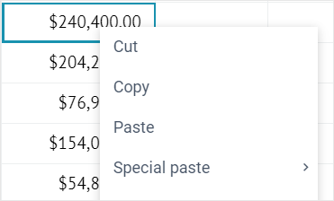

You can also copy the cell(s) via the **"**_Ctrl+C / Command+C_**"** shortcut.

### **Cutting Cells**

To **cut** a cell, you should take the following steps:

1\) Select a cell or a range of cells you want to cut.

2\) Right-click on it and select the **Cut** option in the context menu.

You can also cut a cell via the **"**_Ctrl+X / Command+X_**"** shortcut.

### **Pasting Cells**

To **paste** the copied/cut cell(s), you should take the following steps:

1\) Select the cell(s) you want to paste into.

2\) Right-click on it and select the **Paste** option in the context menu.

You can also paste a cell via the **"**_Ctrl+V / Command+V_**"** shortcut.

When you copy or move the cell(s), you also copy or move styles, applied formulas, and conditional formats with it.

### Special Paste

The widget allows you to perform a special paste. In this case, you can paste the following elements into the cell:

* **values** - paste only the values from the copied cell(s)
* **formulas** - paste only formulas, without values
* **styles** - paste only cell styles
* **conditional formats** - paste only the conditional formats.

To perform the **special paste**, you should take the following steps:

1. Copy a cell or a range of cells.
2. Select the cell you want to paste into.
3. Right-click on it and select the **Special paste** option in the context menu.
4. Select the paste option you need\*\*.\*\*

## Fill a Cell Range Automatically 

You can use the selection handle to fill a range in a certain direction. The range is filled with values that were either copied from the initial selected cell or determined by the pattern of selected cells. To fill in the data, you should take the following steps:

1\) Select the cell that contains the formula or the values that you want to fill in the cells next to it.

2\) Hover over the bottom right corner so that the cursor changes to a plus sign (**+**),

3\) Drag the selection handle across the cells you want to fill.

4\) When you let go, the data is automatically filled in cells.

<figure>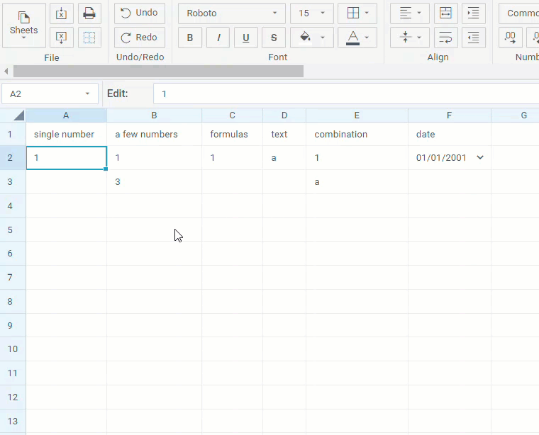<figcaption>
Fill Data Automatically
</figcaption></figure>

### Automatic Fill for Days and Months

You can also automatically fill in days of the week and month names. Both short and full formats are supported (e.g., Mon/Monday, Jan/January). Autofill for days and months is locale-based, meaning it depends on the current locale settings.

Autofill considers the case of the input. If the day or month name is entered entirely in lowercase or uppercase, the same casing is applied to the auto-filled cells. For all other input variations (e.g. MOn, MoNDay), casing follows the default formatting rules of the locale.

<figure>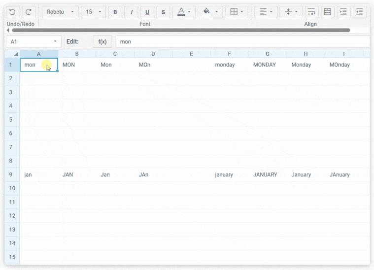<figcaption>
Autofill for Days and Months
</figcaption></figure>

## Sorting Data in a Range

You can sort data in a selected range of cells in both ascending and descending directions. There are two ways to do that:

1\) Select a range of cells that contain data to be sorted.

2\) Make use of the corresponding button in the **Edit** section to sort data in either ascending or descending order:

* Click the **Sort A to Z** button to sort data in the descending order:

* Click the **Sort Z to A** button to sort data in the ascending order:

Or:

1\) Right-click the cell/cells with data to be sorted to call the context menu.

2\) Select _Sort_->_Sort A to Z_, or _Sort_->_Sort Z to A_ option, depending on the desired sorting direction.

In the image below the range is sorted in the ascending order. Pay attention that the values in the **Total** column are recalculated accordingly:

## Adding Filters and Dropdown Lists into Cells

### Adding a Filter

You can add filters for cells of a column. While selecting an option in the added filter, the whole grid data will be filtered according to the value of this option.

To filter data:

1\) Select the necessary range of cells in a column.

2\) Choose one of the following options:

* Click the **Create filter** button in the **Edit** section to add a filter into the top cell of the selected range.

* Right-click the selected range and select the _Create filter_ option in the context menu.

A filter with options (cells' values from the range) will appear in the top cell of the selected range.

3\) Click on any filter option to filter data in the grid.

The image below shows a table filtered by the _Europe_ option from the filter.

### Adding a Dropdown List

You can add a dropdown list with arbitrary options into a cell of a sheet.

It's really easy to do:

1\) Select a cell to add a dropdown menu into.

2\) Click the **Add dropdown** button in the **Edit** section.

3\) In the appeared popup add the range of cells the values of which will be used as options of the dropdown menu. There are two ways for that:

* Type the reference to the range as a pair of the starting and ending cells as A2:A5
* Select a range of cells in a sheet and the reference will appear in the input automatically

4\) To add an empty option to your list, check the **Empty** **option** checkbox.

<figure>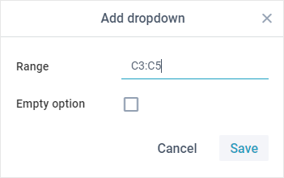<figcaption>
Add Dropdown Popup
</figcaption></figure>

5\) Click the **Save** button to add a dropdown list into a cell.

### Removing Filters and Dropdown Lists

To remove a filter/filters:

1\) Select cells with filters/dropdown lists.

2\) Click the **Clear** button in the **Edit** section of the toolbar.

3\) Select the _Clear dropdowns and filters_ option in the dropdown list.

Or:

1\) Select cells with filters/dropdown lists.

2\) Right-click the selected cell/cells to call the context menu.

3\) Select _Clear_->_Dropdowns and filters_.

## Locking a Cell

You can lock a cell to forbid editing its content. Locked cells will be marked with small orange locks in the bottom right corner. You can neither set the mouse cursor inside of them, nor change their values.

To lock/unlock cells, you can use one of the two available ways:

* Select a cell or several cells you want to lock and click the **Lock/unlock cell** button in the **Edit** section.

* Right-click a selected cell or a range of cells and choose the **Lock/unlock cell** option in the context menu.

## Adding Link into a Cell

It is possible to add a link to an external resource or a specific cell.

To insert a link into a cell:

1\) Select a cell to add a link into.

2\) Choose one of the following options:

* Click the **Add link** button in the **Edit** section:

* Right-click a cell and select the **Add link** option in the context menu.

3\) In the appeared popup enter the text of the link in the first line and insert the link into the second line:

If you want to add the link to a specific cell, use "#" before the cell reference:

<figure>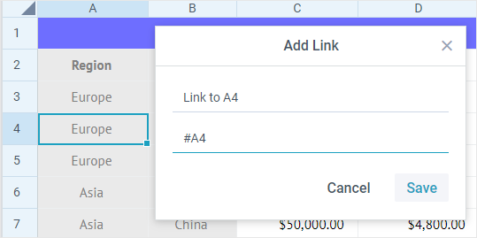<figcaption>
Link to a Specific Cell
</figcaption></figure>

4\) Click the **Save** button to apply changes.

## Adding Image in a Cell

You can add an image into a cell to illustrate data in the spreadsheet.

To insert an image into a cell:

1\) Select a cell to add an image into.

2\) Click the **Image** button in the **Insert** section:

3\) In the appeared popup insert a link to the image or select a file from the computer:

4\) Click the **Save** button to apply changes.

## Adding Sparkline in a Cell

You can add a graph (sparkline) into a cell to display tendencies of data values changing in a range of cells.

To insert a graph into a cell:

1\) Select a cell to add a graph into.

2\) Click the **Graph** button in the **Insert** section:

3\) In the appeared popup enter sparkline configuration:

* choose the type of the line
* set the cell range
* select the color of the graph (except for the Pie type) or two colors (for positive and negative values) for the Bar type

4\) Click the **Save** button to apply changes.

## Adding Comments in a Cell

You can add comments for a cell. To insert comments into a cell:

1\) Select a cell to add comments into.

2\) Choose one of the following options:

* Click the **Comment** button in the **Insert** section:

* Right-click a cell and select the **Comment** option in the context menu.

3\) In the appeared popup enter a text of the comment:

4\) Click any cell outside the textarea to save the comment.

You can change the size of the comment popup by dragging the resizer handle in the right bottom corner.

## Adding Checkboxes and Radio Buttons into a Cell

You can add checkboxes and radio buttons into cells.&#x20;

<figure><figcaption>
Adding Checkboxes and Radio Buttons 
</figcaption></figure>

To insert a checkbox or a radio button into a cell:

1\) Select a cell to add a checkbox or a radio button into.

2\) Choose one of the following options:

* Click the **Controls** button in the **Insert** section of the toolbar and select **Add checkbox** or **Add radio group**:

<figure>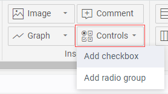<figcaption>
Adding Checkboxes and Radio Buttons via Toolbar
</figcaption></figure>

* Click the **Insert** option in the menu and select **Controls->Add checkbox** or **Add radio group:**

<figure>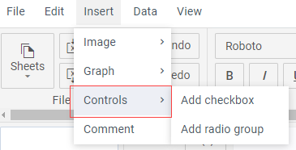<figcaption>
Adding Checkboxes and Radio Buttons via Menu
</figcaption></figure>

## Validating Cells Content

You can add a validation rule for the content of a cell. A validation rule can be added to a cell via the **Validation** button on the Toolbar:

<figure>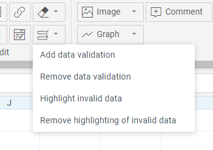<figcaption>
Validation Button Options
</figcaption></figure>

or via the Menu or Context Menu options. A click on the "Add data validation" option will open a dialog popup:

<figure>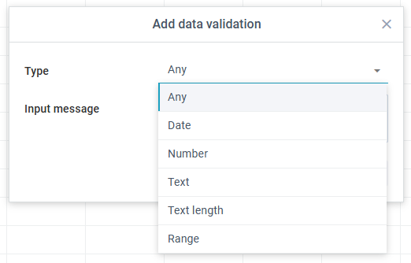<figcaption>
Validation Rules Dialog
</figcaption></figure>

This popup contains a set of validation rule types and their attrubutes. After you add a validation rule to a cell, a click on it will call a textarea with the rule details:

<figure>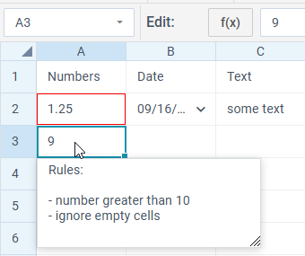<figcaption>
Validation Cell Popup
</figcaption></figure>

A validation rule can have one of the following types:

* "any" (a cell can have any content)
* "date"
* "number"
* "text"
* "textLength"
* "range" (to validate data among a range of cells)

Depending on the **type** of the rule, it can have the following attributes:

* **Integers only** - (for the _number_ type) for accepting only integer numbers
* **Ignore empty** - to ignore/ not ignore empty cells
* **Condition** - the condition that will be applied. Depending on the rule type, may include the following values:
  * greater
  * less
  * greater or equal
  * less or equal
  * equal
  * not equal
  * between
  * not between
  * contains
  * not contains
  * begins with
  * not begins with
  * ends with
  * not ends with
* **Value** - a value or an array of two values (for the rules like "between/not between") that should be compared to the value of the specified cell
* **Input message** - a popup with the text specified in this property will be shown on selection of a cell
* **Error handle** - the way of handling an error (in the corresponding confirm box):
  * "stop" - doesn't allow setting an incorrect value
  * "warning" - allows cancelling the set value
  * "information" - an box informing that the value is not valid
* **Error title** - the header of the confirm box with an error
* **Error message** - the text of the confirm box with an error

## Searching for and replacing data in cells

You can search for and replace data in cells. To provide the necessary parameters for searching and replacing data, click the **Find and Replace** button on the Toolbar and fill in the corresponding fields in the dialog popup:

<figure>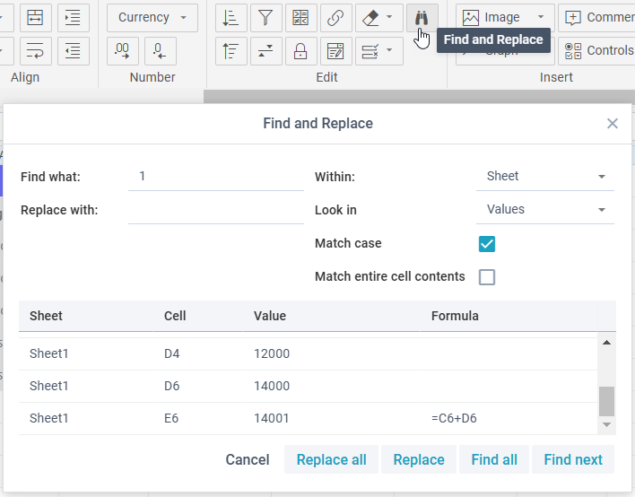<figcaption>
Find and Replace Dialog
</figcaption></figure>

The results of search are rendered in the lower part of the dialog window.

You can adjust the following searching criteria:

* search for data within a sheet or the whole book
* search among values or formulas
* search for results that match the case and/or match the entire cell contents

To replace data in a cell:

* select the necessary cell
* click the **Find and Replace** button and fill in the **Replace with** field&#x20;
* click the **Replace** button

To replace data in all cells:

* click the **Find and Replace** button and fill in the **Replace with** field&#x20;
* click the **Replace** **all** button
