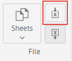
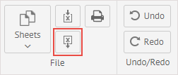

## Import from Excel

It is possible to import data from an Excel file into a sheet of SpreadSheet. Click the Import from Excel button to start importing data:

And choose an Excel file from the content of which you want to export into SpreadSheet from your computer. Its data will be displayed in the current sheet.

## Export to Excel

You can also export the content of a sheet to an Excel file. Click the *Export to Excel button* to start data export: 

In the appeared dialog window, type the name of a new Excel file that will contain the content of the current sheet and click **Save**. A new Excel file with exported data will be downloaded to your computer.
