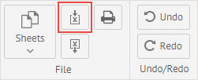
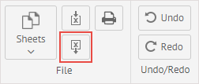
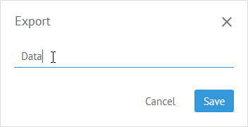

# Excel Import/Export

## Import from Excel

It is possible to import data from an Excel file into a sheet of SpreadSheet.

To import data from Excel:

1\) Click the **Import from Excel** button in the **File** section:

2\) Choose an Excel file the content of which you want to export to SpreadSheet from your computer. Its data will be displayed in the current sheet.

## Export to Excel

You can export the content of a sheet to an Excel file.

To export data to Excel:

1\) Click the **Export to Excel** button in the **File** section:

2\) In the appeared dialog window, type the name of a new Excel file that will contain the content of the current sheet.

3\) Click **Save** to save the file.

A new Excel file with exported data will be downloaded to your computer.

