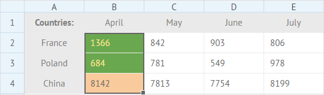
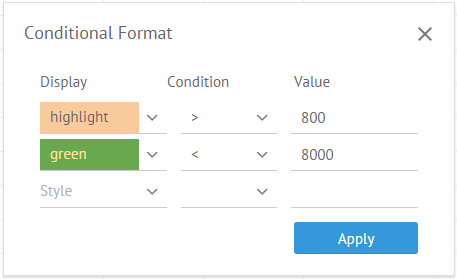
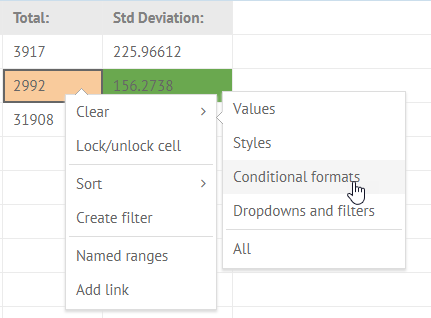

## Font Settings

There is a set of buttons in the **Font** section that allow you to modify the default formatting and apply new font color, style and size as well as change the appearance of a cell - set the background color and apply a new type and color for borders. 

- To apply a different font, click **Font family** and select a suitable font from the list
- To change the size of a font, click **Font size** and choose the size you need
- To make the content of the cell bold, italic or underlined, use the corresponding buttons
- To change the font and background colors, use color pickers attached to the related buttons
- To style and color cell borders, make use of the **Borders** button

##Aligning Cell Content

There are several options for aligning the content of a cell:

- Horizontal alignment: **Left align/Center align/Right align**

- Vertical alignment: **Top align/Middle align/Bottom align**

- Text wrapping

This option allows breaking a long text into several lines to make all the text visible. Text wraps automatically to fit the column width.

##Clear Formatting

You can discard the applied formatting in two ways:

1) Select the necessary cell/cells.
2) Click the **Clear** button in the **Edit** section of the toolbar.
3) Select the *Clear styles* option in the dropdown list.

Or:

1) Right-click the necessary cell/cells to call the context menu.
2) Select *Clear*->*Styles*.

## Merging Cells 

Cells merging allows you to combine neighboring cells into one large cell. 

For example, you can add a common header for several columns. Have a look at the example below:

 

Here cells A1-F1 are merged to add a common label *Report - July 2016* to describe data in the rows 2-5.

To merge several adjacent cells to create a common header, you need to:

1. Copy data from the cells you want to merge into some other place on the sheet, since it will be deleted after merging. 

2. Select the necessary cells and click the **Merge** button.

3. Double-click the new big cell and type the desired text.

4. Apply *Center align* to the cell to center the text.

To split the cells back, just click the button for a second time. The content of the merged cell will be moved into the top left cell.

## Conditional Cells Formatting 

You can set a special format for a cell/cells the values of which correspond to a particular condition or several conditions at once. 

In the example below, cells the values of which are greater than 800 are highlighted in the light orange color. The cells with values less than 8000 are colored in green and their font color changed to yellow:

To apply specific styling to cells, depending on their values:

1) Select the range of cells you want to format.

2) Click the **Conditional format** button on the toolbar. 

     

3) In the opened popup set the conditions (you can set up to three of them at once):

- Use the style selector to choose how the cell will look when conditions are met.
- Choose the condition for comparison (>, <, =, *not equal*, or *between*). 
- Add the number/numbers to compare with.

    

4) Click the **Apply** button.

>####Note
>
>Pay attention that in case some of conditions intersect, only the last of them will be applied.

### Removing conditional formatting

To remove the applied formatting from formatted cells:

1) Select the necessary cell/cells.

2) Click the **Clear** button in the **Edit** section of the toolbar.

3) Select the *Clear styles* option in the dropdown list.

Or:

1) Right-click the necessary cell/cells to call the context menu.

2) Select *Clear*->*Conditional formats*.

