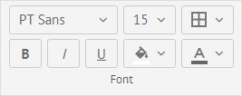
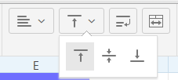
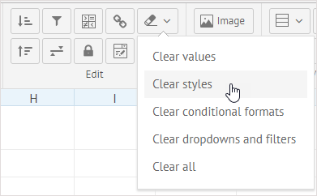
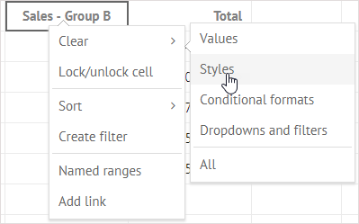
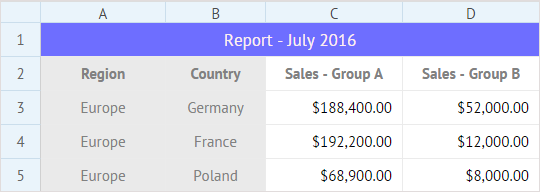

## Font Settings

There is a set of buttons that allow you to modify the default formatting and apply new font color, style and size as well as change the appearance of cell - set the background color and apply a new type and color for borders. 

- To apply a different font, click **Font family** and select a suitable font from the list
- To change the size of font, click **Font size** and choose the size you need
- You can make the content of the cell bold, italic or underlined with the help of the corresponding buttons
- To change the font and background colors, use color pickers attached to the related buttons
- To style and color cell borders, make use of the **Borders** button

##Aligning Cell Content

There are several options for aligning content of a cell:

- Horizontal alignment: **Left align/Center align/Right align**

- Vertical alignment: **Top align/Middle align/Bottom align**

- Text wrapping

This option allows breaking a long text into several lines to make all the text visible. Text wraps automatically to fit the column width.

##Clear Formatting

You can discard the applied formatting in two ways:

1. To remove formatting from all the styled cells, click the **Clear** button in the **Edit** section and select *Clear styles*.

2. To clear formatting applied to a particular cell, right-click the cell to call the context menu and choose the *Clear styles* option:

## Merging Cells 

Cells merging allows you to combine neighboring cells into one large cell. 

For example, you can add a common header for several columns. Have a look at the example below:

 

Here cells A1-F1 are merged to add a common label *Report - July 2016* to describe data in the rows 2-5.

To merge several adjacent cells to create a common header, you need to:

1. Copy data from the cells you want to merge into some other place on the sheet, since it will be deleted after merging. 

2. Select the necessary cells and click the **Merge** button.

3. Double-click the new big cell and type the desired text.

4. Apply *Center align* to the cell to center the text.

To split the cells back, just click the button for a second time. The content of the merged cell will be moved into the top left cell.

