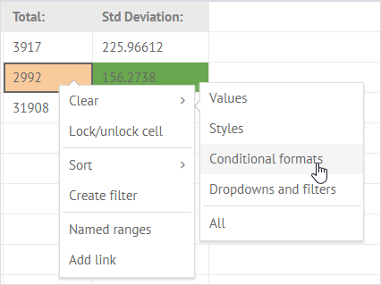

# Formatting Text and Cells

## Font Settings

There is a set of buttons in the **Font** section that allow you to modify the default formatting and apply new font color, style and size as well as change the appearance of a cell - set the background color and apply a new type and color for borders.

* To apply a different font, click **Font family** and select a suitable font from the list.
* To change the size of a font, click **Font size** and choose the size you need.
* To make the content of the cell bold, italic or underlined, use the corresponding buttons.
* To change the font and background colors, use color pickers attached to the related buttons.
* To style and color cell borders, make use of the **Borders** button.

## Aligning Cell Content

You can align the content of a cell in several ways.

* To align cell content **horizontally**:
  * Click the **Horizontal align** button in the **Align** section
  * Select the necessary type of horizontal alignment: **Left align/Center align/Right align**

* To align cell content **vertically**: 
  * Click the **Vertical align** button in the **Align** section
  * Select the necessary type of vertical alignment: **Top align/Middle align/Bottom align**

* To wrap long text to present it on multiple lines in a cell:
  * Select the cell with text you want to wrap
  * Click the **Text wrap** button in the **Align** section

Text is wrapped automatically to fit the column width.

## Clear Formatting

You can discard the applied formatting in two ways:

1\) Select necessary cell/cells with formatting.

2\) Click the **Clear** button in the **Edit** section of the toolbar.

3\) Select the _Clear styles_ option in the dropdown list.

Or:

1\) Select necessary cell/cells with formatting.

2\) Right-click the selected cell/cells to call the context menu.

3\) Select _Clear_-&gt;_Styles_.

## Merging Cells

Cells merging allows you to combine neighboring cells into one large cell.

For example, you can add a common header for several columns. Have a look at the example below:

_Merging cells A1-D1 to make a header for a table_

To merge several adjacent cells, you need to:

1\) Copy data from the cells you want to merge into some other place on the sheet, since it will be deleted after merging.

2\) Select the necessary cells and click the **Merge** button in the **Align** section.

3\) Double-click the new big cell and type the desired text.

4\) Optionally, click the **Horizontal align** button and apply _Center align_ to the cell to center the text.

### Splitting Merged Cell

To split a merged cell:

* Select the merged cell that should be split into several cells.
* Click the **Merge** button.

## Conditional Cells Formatting

You can set a special format for a cell/cells the values of which correspond to a particular condition or several conditions at once.

In the example below, cells the values of which are greater than 800 are highlighted in the light orange color. The cells with values less than 8000 are colored in green and their font color changed to yellow:

To apply specific styling to cells, depending on their values:

1\) Select the range of cells you want to format.

2\) Click the **Conditional format** button in the **Edit** section of the toolbar.

3\) In the opened popup set the conditions \(you can set up to three of them at once\):

* Use the style selector to decide on what the cell will look like when conditions are met.
* Choose a condition for comparison \(&gt;, &lt;, =, _not equal_, or _between_\). 
* Add the value to compare with.

4\) Click the **Apply** button.

> #### Note
>
> Pay attention that in case some of conditions intersect, only the last of them will be applied.

### Removing Conditional Formatting

To remove conditional formatting from formatted cells:

1\) Select necessary cell/cells.

2\) Click the **Clear** button in the **Edit** section of the toolbar.

3\) Select the _Clear conditional formats_ option in the dropdown list.

Or:

1\) Select necessary cell/cells.

2\) Right-click the selected cell/cells with conditional formatting to call the context menu.

3\) Select _Clear_-&gt;_Conditional formats_.

