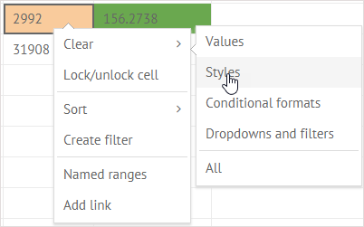

##Default Number Format

To differentiate between types of numbers, you can apply the corresponding format to them:

- *Common* - a simple number
- *Currency* - a format to display a number as currency ($)
- *Number* - a format to display a number with delimited tens, hundreds and thousands
- *Percent* - a format to display a number as percentage (%)

To apply a number format to cell values:

1. Select a cell or a range of cells to format
2. Click the **Number format** button to open a dropdown list with number formats:

3. Choose the necessary format that will be applied to the selected cells:

##Custom Number Format

If you feel limited by the embedded number formats, you can create your own format. You just need to comply with the requirements below.

###Requirements

The added format should consist of up to 4 sections of code, separated by semicolons (;). The sections define the format of code for enumerated cell values in the provided order: 

- positive numbers; 
- negative numbers; 
- zero values;
- text.

You can customize these number format code sections according to the rules given below:

1. **Significant digits, decimal and thousands separators**

- **0 (zero)** - the digit placeholder to display insignificant zeros, if a number has fewer digits than there are zeros in the format. For example, to display **4** as **4.0**, use the format **0.0**.
- **#** - the digit placeholder to display only significant numbers (not to display extra zeros when the number has fewer digits than there are **#** symbols in the format).
- **.** (period) - the digit placeholder to display the decimal point in a number.
- **,** (comma) - the digit placeholder to display the thousands separator in a number.

2. **Conditions**

If you need to apply a format to a number only if it meets the specified condition, place this condition inside of square brackets as in:

[>1000]> 0.0;

3. **Colors**

To define a color for a particular section of a format, put the desired color name into square brackets as follows:

[>1000][red];[>100][green]0.0;

4. **Text**

In case you need to add text into some section, you can type it as it is. The only requirement is that text should go last in a section:

[>1000][red];[>100][green]0.0;[blue] Small

##How to Apply

To set a custom format to cell values:

1. Select a cell or a range of cells to apply a custom format to.
2. Click the **Custom format** button: 

     

In the appeared popup enter the new format for the cells and click **Save**.

For example, let's apply a custom format for the selected cells in a spreadsheet:

We will apply the following format patterns to the cells:

1. For the cells **B2** and **C2**: *[>1000]> 0.0;[>100]Check 0,000.0#;[=0]Nope;*
2. For the cell **B3**: *[>1000][red];[>100][green]0.0;[blue] Small;*

That's how the cell's contents are formatted after the format is applied to them:

##Clear Formatting

You can remove the applied formatting in two ways:

1. To remove the applied formatting from all the styled cells, click the **Clear** button in the **Edit** section and select *Clear styles*:

2. To clear formatting applied to a particular cell, right-click the cell to call the context menu and choose the *Clear styles* option:

