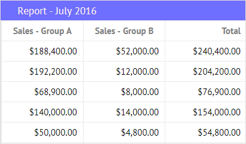
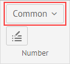
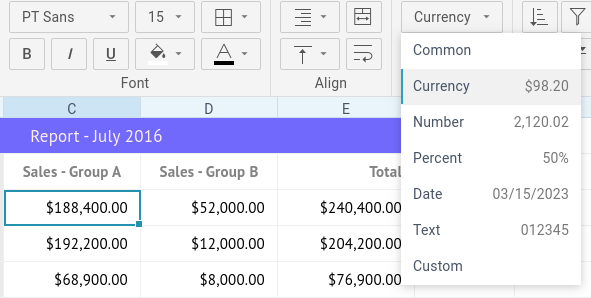
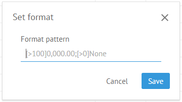
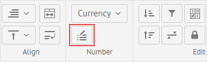
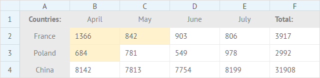
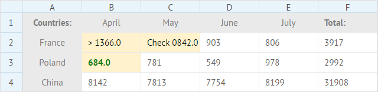

##Default Number Formats

To differentiate between types of numbers, you can apply a corresponding format to them. There are the following formats available:

- *Common* - a simple number
- *Currency* - a format to display a number as currency ($)
- *Number* - a format to display a number with delimited tens, hundreds and thousands
- *Percent* - a format to display a number as percentage (%)

To apply a number format to cell values:

1) Select a cell or a range of cells to format.

2) Click the **Number format** button to open a dropdown list with number formats:

3) Choose the necessary format that will be applied to the selected cells:

##Custom Number Format

If you feel limited by the embedded number formats, you can create your own format. The added format should consist of up to 4 sections of code, separated by semicolons (;). 

Each code section can include:

- a condition to compare a cell value with
- a necessary format for a cell
- a style that will be applied to a cell 
- a text that should be displayed in a cell

The details are given in the section **Custom Format Rules**.

For example:

[>1000][red];[>100][green]0.0;[blue] Small

###How to Apply

To set a custom format to cell values:

1) Select a cell or a range of cells to apply a custom format to.

2) Click the **Custom format** button: 

     

3) In the appeared popup enter the new format for the cells and click **Save**.

For example, for the selected cells in a spreadsheet:

The following custom format patterns are applied:

1. For the cells **B2** and **C2**: *[>1000]> 0.0;[>100]Check 0,000.0#;[=0]Nope;*
2. For the cell **B3**: *[>1000][red];[>100][green]0.0;[blue] Small;*

And the result is shown below:

###Custom Format Rules

The code sections of the custom number format are set according to the rules given below:

1) **Conditions**

To apply a format to a number only if it meets the specified condition, place this condition inside of square brackets as in:

[>1000]> 0.0;

2) **Format**

To apply a particular custom number format to the value of a formatted cell, define the format as a set of zeros (e.g. 0.0;) which:
	- are separated by decimal or thousand separators
	- have additional 0 after the separator to display insignificant zeros or # to ignore them

3) **Colors**

To define a color for a particular section of a format, put the desired color name into square brackets as follows:

[>1000][red];[>100][green]0.0;

4) **Text**

In case you need to add text into some section, you can type it as it is. The only requirement is that text should go last in a section:

[>1000][red];[>100][green]0.0;[blue] Small

####Significant digits, decimal and thousands separators

- **0 (zero)** - the digit placeholder to display insignificant zeros, if a number has fewer digits than there are zeros in the format. For example, to display **4** as **4.0**, use the format **0.0**.
- **#** - the digit placeholder to display only significant numbers (not to display extra zeros when the number has fewer digits than there are **#** symbols in the format).
- **.** (period) - the digit placeholder to display the decimal point in a number.
- **,** (comma) - the digit placeholder to display the thousands separator in a number.

##Clear Formatting

You can discard the applied formatting in two ways:

1) Select necessary formatted cell/cells.

2) Click the **Clear** button in the **Edit** section of the toolbar.

3) Select the *Clear styles* option in the dropdown list.

Or:

1) Select necessary formatted cell/cells.

2) Right-click the necessary cell/cells to call the context menu.

3) Select *Clear*->*Styles*.

