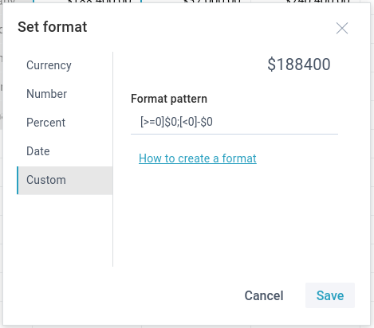

##Default Number Format

To differentiate between types of numbers, you can apply a corresponding format to them. There are the following formats available:

- *Common* - no formatting applied
- *Currency* - a format to display a number as currency ($)
- *Number* - a format to display a number with delimited tens, hundreds and thousands
- *Percent* - a format to display a number as percentage (%)

To apply some of the default number formats to a cell value:

1) Select a cell or a range of cells to format.

2) Click the **Number format** button in the **Number** section to open a dropdown list with number formats:

3) Choose the necessary format that will be applied to the selected cells:

###Customizing Default Formats

You can customize the predefined formats in the following ways:

- define the number of decimal places
- show or hide group separators (for the *Currency* and *Number* formats)
- define the styling of negative values

To customize a predefined number format:

1) Select a cell or a range of cells to apply custom format to.

2) Click the **Number format** button in the **Number** section: 

     

3) Select *Currency*, *Number* or *Percent*:

4) Define settings for the chosen format and click **Save**.

###Increasing/decreasing Decimal Places

To increase/descrease decimal places:

1) Select the necessary cell with a decimal number value.

2) Click the corresponding button - *Increase decimal places* or *Decrease decimal places* in the **Number** section:

##Custom Number Format

If you feel limited by the embedded number formats, you can create your own format. 

To set a custom format to cell values:

1) Select a cell or a range of cells to apply a custom format to.

2) Click the **Number format** button in the **Number** section and select the *Custom* option: 

     

3) In the appeared popup:

- Specify a custom format pattern and press **Enter** or click outside the input to preview result.
- Click **Save** to apply the specified format pattern to the cell/cells value(s).

### Custom format structure

A custom format may consist of several code sections, separated by semicolons (;). Each code section can include:

- **[condition]** in square brackets - e.g. [>1000], to compare the cell value with
- **[color]** in square brackets - e.g. [blue]
- **format** as a set of zeros (e.g. 0.0;) 
- **text** - e.g. Text, that should be displayed in this cell

>####Note
>
>If there are both the condition and the color sections, the condition must go first.

For example:

`[>1000][red];[>100][green]0.0;[blue] Small`

In the spreadsheet below:

The following custom format patterns are applied:

1. For the cells **B2**-**C2**: *[>1000]> 0.0;[>100][orange]Check 0,000.0#*
2. For the cell **B3**-**D3**: *[>1000][red];[>700][green]0.0;[blue]Small*

###Custom Format Rules

The code sections of the custom number format are set according to the rules given below:

1) **Conditions**

To apply a format to a number only if it meets the specified condition, specify a condition inside of square brackets. It should contain a comparison operator and a value:

`[>1000]> 0.0;`

2) **Format**

To apply a particular custom number format to the value of a formatted cell, define the format as a set of zeros (e.g. 0.0;) which:
	- are separated by decimal or thousand separators
	- have additional 0 after the separator to display insignificant zeros or # to ignore them

`[>100]0,000.00`

3) **Colors**

To specify some color for a section of the format, type the name of one of the available colors (*green*, *red*, *blue*, *orange*, *black*, *violet* or *magenta*) enclosed in square brackets in the section. The color code must be the second item in the section (after the condition).

`[>1000][red];[>100][green]0.0;`

4) **Text**

In case you need to add text into some section, you can type it as it is. The only requirement is that text should go last in a section, like this:

`[>1000][red];[>100][green]0.0;[blue] Small`

####Significant digits, decimal and thousands separators

- **0 (zero)** - the digit placeholder to display insignificant zeros, if a number has fewer digits than there are zeros in the format. For example, to display **4** as **4.0**, use the format **0.0**.
- **#** - the digit placeholder to display only significant numbers (not to display extra zeros when the number has fewer digits than there are **#** symbols in the format).
- **?** - works the same as 0 (zero), but adds a space for insignificant zeros on either side of the decimal point so that decimal points are aligned in the column.
- **.** (period) - the digit placeholder to display the decimal point in a number.
- **,** (comma) - the digit placeholder to display the thousands separator in a number.

##Clear Formatting

You can discard the applied formatting in two ways:

1) Select necessary formatted cell/cells.

2) Click the **Clear** button in the **Edit** section of the toolbar.

3) Select the *Clear styles* option in the dropdown list.

Or:

1) Select necessary formatted cell/cells.

2) Right-click the necessary cell/cells to call the context menu.

3) Select *Clear*->*Styles*.

