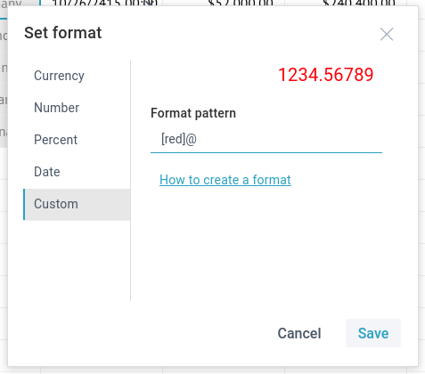

# Formatting Text

For text, there are these formats available:

- *Common* - whenever possible, the value will be formatted as a number; otherwise as text
- *Text* - no special formatting, the text will be displayed as is

To apply the default text format to a cell value:

1) Select a cell or a range of cells to format.<br>
2) Click the **Text format** button in the Number section to open a drop-down list with number formats.<br>
3) Choose the necessary format that will be applied to the selected cells.<br>

## Custom Text Format

You can customize the predefined formats by adding color for the text or adding some static text for cell values.

To customize a predefined text format:

1) Select a cell or a range of cells to apply custom format to.<br>
2) Click the format button in the **Number** section and select the **Custom** option.<br>
3) Select **Custom**.<br>
4) Add a color before "@", e.g. ```[red]``` or add *"Some text"* to the line.<br>



An example of a format line:

`[blue]@ "Some extra text here"`

5) To apply the new format, click **Save**.
