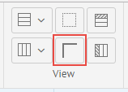
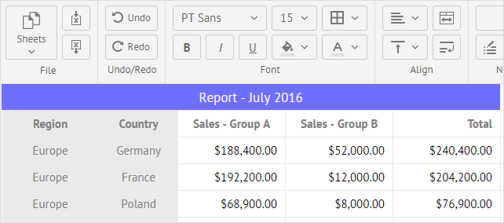
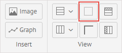
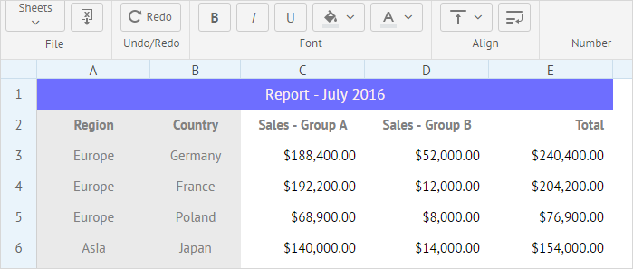

## Hiding/Showing Rows and Columns Headers

You can easily hide the headers of rows and columns and show them again. Use the **Hide/show headers** button for this purpose.

After that, the blue headers that contain numbers to specify rows and letters to mark columns will be hidden:

To show the headers again, click the **Hide/show headers** button again.

## Hiding/Showing Grid Lines 

The grid lines of the sheet can be hidden as well, if needed. To hide them, click the **Hide/show gridlines** button.

This is how a sheet with content will be displayed with grid lines hidden:

To show grid lines again, click the **Hide/show gridlines** once again.
