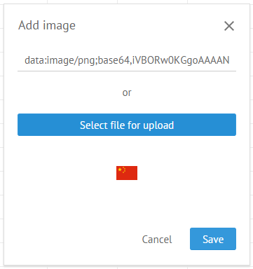

Besides usual text, numbers or formulas you can add sparklines (graphs) and images into the cells of Webix SpreadSheet.

## Adding Sparklines

A sparkline is a small colored chart used for displaying tendencies of data values changing.

To add a sparkline into a cell:

1) Select the cell you want to insert a graph into.

2) Click the **Graph** button on the toolbar. 

3) Set your preferences in the appeared popup:

- Choose the type of a sparkline:
	- Line
	- Spline
	- SplineArea
	- Area
	- Bar
	- Pie
- Set a cell range that should be displayed in the sparkline, e.g. **B3:E3**
- Select the color of the graph, depending on the chosen type of sparkline:
	-  one color for the Line, Spline, SplineArea or Area types
	-  separate colors for bars responsible for positive and negative values in the Bar type of sparkline
	-  colors for sections of the Pie type of sparklines are predefined, you don't need to change any 

4) Once you've made your choice, press **Enter** to see the sparklines preview at the bottom of the popup:

If you are satisfied with the result, move to the step 5. Otherwise, make changes in the settings and press **Enter** for preview.

5) Click the **Save** button to insert the resulting sparkline into the cell.

## Adding Images

You can add images into SpreadSheet cells to make your documents more illustrative:

To add an image into a cell:

1) Select a cell to insert an image inside.
2) Click the **Image** button

3) Decide on the way you want to add an image in the appeared popup:

- Copy the image URL and insert it into the input field to upload the image from the external resource
- Upload the image directly from your computer by clicking **Select file for upload**. In this case the local path to the image will be displayed instead of URL in the input field:

