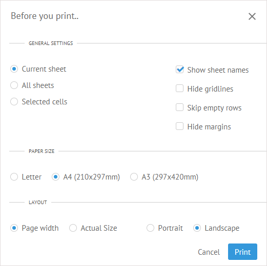

Webix SpreadSheet allows you to print the contents of the current sheet, all the sheets at once or even particular cells.
There are various settings provided to help you print your document in the desired format. It is also possible to print to a file instead of right to a printer. 

##Print Dialog Window

Before starting to print, you should check your preferences in the print dialog window. 

To call the print dialog:

- Click the **Print** button.

- Use the **Ctrl+P** hot keys. 

In the appeared printing dialog you can decide on some common options, select the appropriate size and orientation of paper and the size of the content.

## General Settings

### Select What Data to Print

You can specify what part of the spreadsheet you want to print by selecting one of the available options:

- *Current sheet* - all data from the current sheet 
- *All sheets* - all data from all sheets
- *Selected cells* - selected data from the current sheet

### Check Extra Options

There are additional printing parameters. You can check just one, or all of them, or ingore those settings.

- *Show sheet names* - render the names of sheets for each table 
- *Hide gridlines* - remove borders of datatable cells
- *Skip empty rows* - skip empty rows within the datatable 
- *Hide margins* - hide margins for printed pages 

##Paper Size

There are three predefined sizes of paper you can choose from:

- Letter 
- A4 (210x297mm)
- A3 (297x420mm)

##Layout Appearance

For the page layout you can set two types of settings:

- *Size of the content* that can be equal to:
	- Page width
	- Actual size

- *Paper orientation* which can be set as:
	- Portrait
	- Landscape