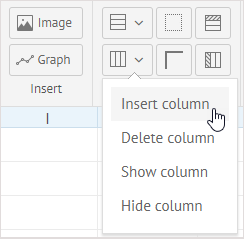
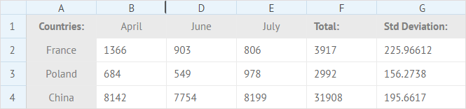

You can insert new rows and columns, delete some of them, or just hide them and show, when necessary. All these actions are controlled by the 
**Rows** and **Columns** groups of buttons in the **View** section.

##Working with Rows

###Inserting Rows

It is possible to insert a new empty row into spreadsheet. A new row is added above the selected one. 

To insert an empty row, follow one of the ways below:

1. Select the row above which you want to insert an empty one - just click on its header.
2. Click the **Rows** button in the **View** section to open a dropdown menu and choose the *Insert row* option.

Or:

1. Right-click the header of the row. 
2. Select *Insert row* in the context menu.

###Deleting Rows

To delete a row, follow one of the ways below:

1. Select the row you want to delete. 
2. Click the **Rows** button in the **View** section to open a dropdown menu and choose the *Delete row* option.

Or:

1. Right-click the header of the row.
2. Select *Delete row* in the context menu.

###Hiding Rows

The hidden row is marked as a bold line between the headers of the rows above and below:

To hide a row, follow one of the ways below:

1. Select the row you want to hide by clicking on its header.
2. Click the **Rows** button in the **View** section to open the dropdown menu and choose the *Hide row* option.

Or:

1. Right-click the header of the row.
2. Select *Hide row* in the context menu.

 
###Showing Rows

To show a hidden row, follow one of the ways below:

1. Select either the row above or below of the hidden one. 
2. Click the **Rows** button in the **View** section to open the dropdown menu and choose the *Show row* option.

Or:

1. Right-click the row previous to the hidden one or the row that follows it.
2. Select *Show row* in the context menu.

 
## Working with Columns

###Inserting Columns

You can insert an empty column into spreadsheet. A new column is added to the left of the selected one.

To insert an empty column:

1. Select the column to the left of which you want to insert an empty one - just click on its header.
2. Click the **Columns** button in the **View** section to open the dropdown menu and select the *Insert column* option.

Or:

1. Right-click the header of the column.
2. Select *Insert column* in the context menu.

###Deleting Columns

To delete a column:

1. Select the column you want to delete by clicking on its header. 
2. Click the **Columns** button in the **View** section to open the dropdown menu and choose the *Delete column* option.

Or:

1. Right-click the header of the column.
2. Select *Delete column* in the context menu.

### Hiding Columns

You can hide a column and show it again, when needed. The hidden column is marked as a bold line between the headers of the columns to the left and to the right.

To hide a column, follow one of the ways below:

1. Select the column you want to hide by clicking on its header. 
2. Click the **Columns** button in the **View** section to open the dropdown menu. Choose the *Hide column* option.

Or:

1. Right-click the header of the column.
2. Select *Hide column* in the context menu.

### Showing Columns

To show a hidden column, follow one of the ways below:

1. Select either the column to the left or to the right of the hidden one. 
2. Click the **Columns** button to open the dropdown menu and choose the *Show column* option.

Or:

1. Right-click the column to left or to the right of the hidden one.
2. Select *Show column* in the context menu.

## Frozen Columns and Rows

### Freezing Rows

It's possible to freeze a row with data in a spreadsheet. This row will remain visible on the screen during vertical scrolling. 

To freeze a row:

1) Select the row you want to freeze by clicking its header.

*The 3rd row will be frozen*

2) Click the **Freeze/unfreeze rows** button in the **View** section:

3) Scroll the sheet vertically to see that the selected row will remain in its place, while the rows below will be scrolled up and disappear under the static part of the sheet:

### Freezing Columns

You can freeze a column with data to make it always visible on the screen independently of horizontal scrolling.  

To freeze a column:

1) Select the column you want to freeze by clicking its header.

*The column C will be frozen*

2) Click the **Freeze/unfreeze columns** button in the **View** section:

3) Scroll the sheet horizontally to see that the selected column will stay in its place, while the columns to the right will be scrolled to the left and become hidden behind the static part of the sheet:

