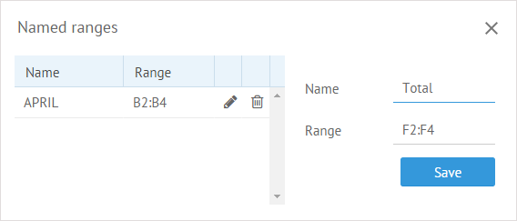

# Using Formulas for Math Calculations

Webix SpreadSheet supports simple math expressions and allows making calculations with the help of formulas. The following elements are allowed in formulas:

* numbers
* basic mathematical operators, which are: +, -, /, \*
* comparison operators: **<**, **>**, **<=**, **>=**, **<>**, **=**
* the **&** operator for connecting two or more text strings into a single text
* cell references
* Excel-like functions

## Adding a Formula

There are two ways you can add a formula.

To add formula manually:

1. Type the **=** sign in a cell to start the formula.
2. Type a combination of numbers and math operators:

* **+** - for adding
* **-**  - for subtracting
* **\*** - for multiplying
* **/** - for dividing

For example: =8+5, =8-5, =8\*5, =8/5.

You can also enter any Excel function after the "=" symbol, f.e. =SUM(C2:D2).

To add a formula from the list:

1. Select the cell where you want the formula to go.
2. Click the “Add formula” button. A popup window opens with a list of formulas and an input field.
3. In the input field, start typing the name of the desired formula. As you type, matching formulas will appear in a drop-down list.
4. Select the formula from the drop-down list once it appears.

<figure><figcaption>
Adding a formula
</figcaption></figure>

In case the "methods" option is enabled in the SpreadSheet configuration, you can choose a formula by the category:

<figure><figcaption>
Adding a formula by category
</figcaption></figure>

At the end press the **Enter** button to get the result of formula calculation.

You can show formulas in cells instead of values. To do it, click on the **Hide/show formulas** button in the **View** section.

## The List of Supported Functions

SpreadSheet can work with the Excel functions. For more details on these functions, please see the [documentation](https://support.microsoft.com/en-us/office/excel-functions-alphabetical-b3944572-255d-4efb-bb96-c6d90033e188) for Microsoft Excel.

You can find the full list of functions that are supported by SpreadSheet [here](https://docs.webix.com/spreadsheet__functions.html).

## Adding Named Range

You can specify a name for a particular range of cells and then use it in formulas for calculations. Thus, the formula will be easier to understand and work with.

To add a named range:

1\) Choose one of the ways below:

* Click the **Named Ranges** button in the **Edit** section.

* Right-click any cell and select the _Named Ranges_ option in the context menu.

2\) In the opened popup specify the desired name and add cells that will be included in the range in one of the ways below:

* Type the reference to the range as a pair of the starting and ending cells as A2:A5
* Select a range of cells in a sheet and the reference will appear in the input automatically

_Adding a range named Total for cells F2-F4_

3\) Click the **Save** button to save a new range. It will appear in the list of ranges in the left part of the popup.

You can navigate between ranges using the dropdown list from the navigation input field:

<figure><figcaption>
Named Ranges List
</figcaption></figure>

Note that this list will contain only ranges with the entire book scope or the current worksheet.

### Using Named Range in Formulas

After a named range is added into a list, you can use it as an argument in a function/formula. The image below shows how the _Total\_range for cells F2-F4 is used in the \_SUM_ function:

As a result, the values of the cells F2-F4 are summed up.

### Editing Named Range

To make changes in an existing named range:

1\) Click the **Named Ranges** button

2\) Apply the necessary action by clicking the corresponding icon in the line with the named range in question:

* To edit the range, click the "pencil" icon.
* To delete the range, click the "basket" icon.

