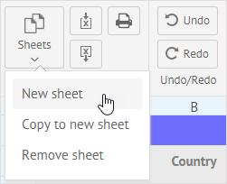
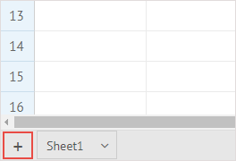
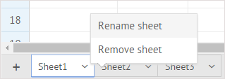
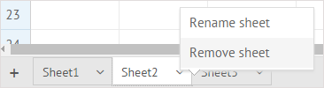
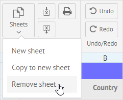
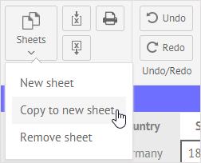
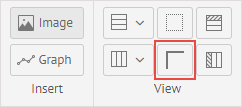
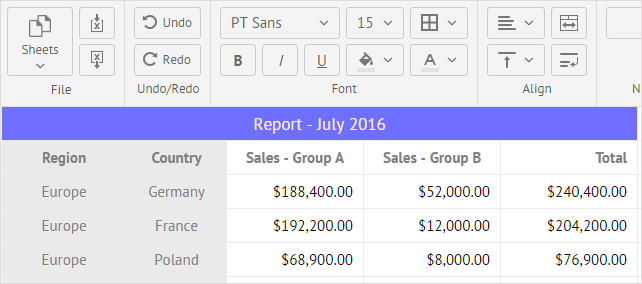
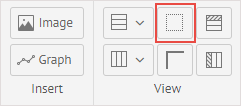
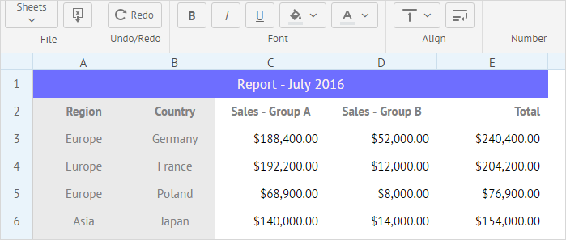

# Working with Sheets

## Adding a New Sheet

There are several options for adding a new sheet into a SpreadSheet:

1\) Click the **Sheets** button in the **File** section and choose the _New sheet_ option:

2\) Click the "plus" button in the bottom left corner of the widget:

In both cases a tab with a new sheet will be added into the bottom bar to the right of the existing sheets tabs.

## Renaming a Sheet

To rename a sheet:

1\) Click the arrow in the tab with the necessary sheet and select _Rename sheet_ in the context menu.

2\) Type a new name for the sheet and press **Enter** to save changes.

## Removing a Sheet

You can remove a sheet together with its data by using one of the two ways:

1\) Click the arrow in the corresponding tab of the bottom bar and select _Remove sheet_ in the context menu:

The related sheet will be deleted. Note that the names of other sheets won't be changed.

2\) To remove the currently active sheet, you can click the **Sheets** button in the **File** section and select the _Remove sheet_ option:

## Copying Sheet Content

You can copy data of a sheet and create a new sheet with the same content.

To copy the content of a sheet:

1. Click the **Sheets** button in the **File** section.
2. Select the _Copy to a new sheet_ option.

After that a new sheet will appear. It will contain the content identical to that of the active sheet. A tab with the name of the new sheet will be added into the bottom bar.

## Hiding/Showing Rows and Columns Headers

You can easily hide the headers of rows and columns and show them again.

To hide headers, click the **Hide/show headers** button in the **View** section.

After that, the blue headers that contain numbers to specify rows and letters to mark columns will be hidden:

To restore headers, click the **Hide/show headers** button again.

## Hiding/Showing Grid Lines

The grid lines of the sheet can be hidden, if needed.

To hide grid lines, click the **Hide/show gridlines** button.

This is how a sheet with content will be displayed with grid lines hidden:

To restore grid lines, click the **Hide/show gridlines** button again.

