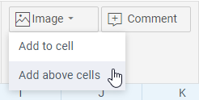
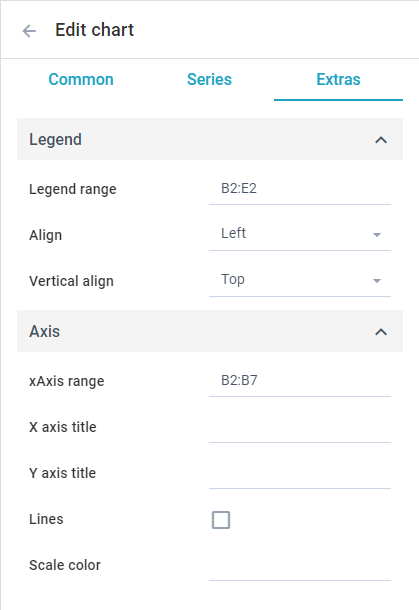

# Working with embedded Charts and Images

It is possible to add and fine-tune above-cell charts and images in Spreadsheet. 

## Adding Views to Spreadsheet

To add a view to SpreadSheet click the **Image** button (or **Graphs** for charts) in the **Insert** section and choose the *Add above cells* option:

After that select an image to upload or provide a configuration for the new chart via the dialog for editing.

## Working with Charts

### Specifying Data for Charts

In order to display data in a chart you should specify the source of the cells for it. There are 2 ways to do it:

1\) Type the range of cells you want to get data from in the **Range** field:

You can also define the left column as the X-axis or/and the top row as the legend, by checking the corresponding checkboxes.

**Note** that the range values are case-sensitive and must be in the upper-case.

2\) Put the cursor in the **Range** field and then select the area of the cells you want to get data from. The range will be calculated automatically:

### Working with Series

Roughly speaking all default chart types can be divided into two groups:

1. Linear (*Line, Spline, Spline Area, Area, Bar, and Radar*)
2. Circular (*Pie and Donut*)

You can work with a separate series of the linear charts.

In the **Series** tab you can:

1. Specify the range for a series 
2. Choose an appropriate color from a color picker
3. Enable or disable tooltips for markers
4. Define the markers shape 
5. Delete a series or add a new line

### Working with Legend and Axes

In the **Extras** tab you can tune the look of the legend and axes.

#### Tuning Legend

To define the data source for the legend you should provide the range of the cells to get data from in the **Range** field.

It is also possible to specify the *horizontal* and *vertical alignment* of the legend via the corresponding controls.

#### Tuning Axes

To define the data source for the X-axis type the range of the cells to get data from in the traditional **Range** field.

You can also provide *titles* for both X and Y-axes, enable the *background grid* and choose its *color* through the corresponding controls on the panel.

## Downloading Views

To download an image or a chart click on the menu in the right top corner of a view, mouse over the *Download* option and choose an appropriate variant:

## Removing Views from Spreadsheet 

In order to remove an image or a chart from SpreadSheet click on the menu in the right top corner of a view and choose the corresponding option:

You can also remove a view by selecting it and pressing the *Backspace* key. 

