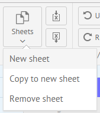
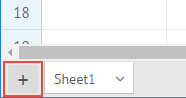
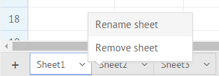
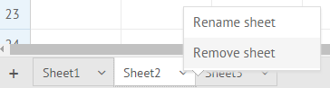
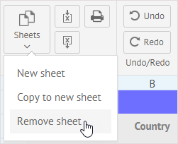
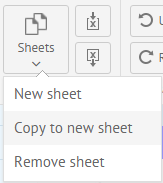

## Adding a new sheet

There are several options for adding a new sheet into a SpreadSheet:

1) Click the **Sheets** button and choose the *New sheet* option:

2) Click the "plus" button in the bottom left corner of the widget:

In both cases a tab with a new sheet will be added into the bottom bar to the right of the existing sheets tabs.

## Renaming a sheet

To rename a sheet, click on the arrow in the tab with the necessary sheet and select *Rename sheet* in the context menu.

Type a new name for the sheet and press **Enter** to save changes.

## Removing a sheet

You can remove a sheet together with its data by using one of the two ways:

1) Click the arrow in the corresponding tab of the bottom bar and select *Remove sheet* in the context menu:

The related sheet will be deleted. Note that the names of other sheets won't be changed.

2) To remove the currently active sheet, you can click the **Sheets** button and select the *Remove sheet* option:

## Copying sheet content

You can copy data of a sheet and create a new sheet with the same content. Just click the **Sheets** button and select the *Copy to a new sheet* option.

After that a new sheet with identical content will appear and a tab with its name will be added into the bottom bar.
